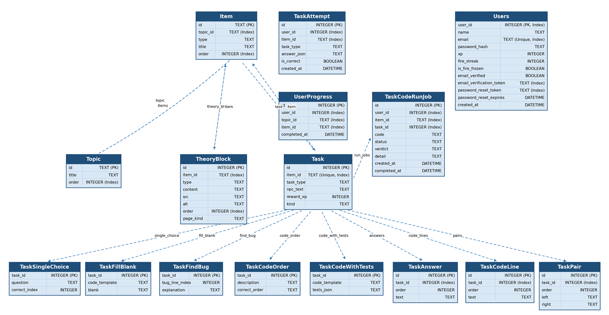

# Курсовой проект. Веб-приложения для обучения языку программирования С# с элементами геймификации. Серверная часть

Исполнители: **Быков Дмитрий Александрович**, БПИ244


Научный руководитель:  **Лесовская Ирина Николаевна**, кандидат технических наук, доцент департамента программной инженерии

### Предметная область

- Веб-приложение для изучения C# включающее в себя: теоретические блоки, практические задания и элементы геймификации.
- Целевой аудиторией являются люди, желающие изучить язык программирования C# и предпочитающие интерактивный формат обучения с элементами геймификации.
- Параллельно с изучением теории и выполнением практических заданий разных видов происходит продвижение по сюжету.

### Структура проекта
 
- app - FastAPI-приложение
  - api/v1/routers - HTTP-эндпоинты (auth, users, course, tasks, progress)
  - core - конфигурация, JWT, безопасность
  - db - подключение к PostgreSQL, базовые модели SQLAlchemy
  - models - ORM-модели (пользователи, курс, задания, прогресс)
  - repositories - доступ к данным
  - schemas - Pydantic-схемы запросов и ответов
  - services - бизнес-логика (курс, авторизация, проверка кода)
  - main.py - точка входа API
- course_content - контент курса (уроки, задания, тесты)
- csharp_runner - отдельный сервис компиляции и запуска C#-кода
- docker-compose.yml - PostgreSQL, API и csharp_runner
- Dockerfile - образ API
- requirements.txt - зависимости Python

### Запуск через Docker

Нужны Docker (https://docs.docker.com/get-docker/) и Docker Compose (входит в Docker Desktop).

1. Перейдите в каталог с серверной частью:

```bash
cd backend
```

2. Создайте файл `backend/.env` (в репозиторий не попадает). Пример для Docker:

```env
# обязательно: секрет для подписи JWT (замените на свой)
JWT_SECRET_KEY=dev-secret-change-me

# для загрузки курса через /api/v1/course/admin (HTTP Basic)
COURSE_ADMIN_EMAIL=admin@example.com
COURSE_ADMIN_PASSWORD=admin-password

# опционально: письма (подтверждение почты, сброс пароля)
# SMTP_HOST=smtp.example.com
# SMTP_PORT=587
# SMTP_USER=user@example.com
# SMTP_PASSWORD=password
# SMTP_FROM=noreply@example.com
# SMTP_USE_TLS=true

# опционально: ссылки в письмах и на фронтенд
# FRONTEND_BASE_URL=http://localhost:5173
# API_PUBLIC_BASE_URL=http://localhost:8000
```

Обязательно укажите `JWT_SECRET_KEY` - любой длинный секрет для токенов.

Если нужна загрузка курса через админские ручки - задайте `COURSE_ADMIN_EMAIL` и `COURSE_ADMIN_PASSWORD`.

Для отправки писем (подтверждение почты, сброс пароля) - `SMTP_HOST`, `SMTP_PORT`, `SMTP_USER`, `SMTP_PASSWORD`, `SMTP_FROM`. Без SMTP API работает, письма просто не отправляются.

Остальное можно не трогать: ссылки для писем (`FRONTEND_BASE_URL`, `API_PUBLIC_BASE_URL`), сроки токенов, настройки XP - у всех есть значения по умолчанию в коде.

В Docker `DATABASE_URL`, `CODE_RUNNER_URL`, `CODE_RUN_CALLBACK_SECRET` и `CODE_RUN_INTERNAL_BASE_URL` уже прописаны в `docker-compose.yml`, в `.env` их писать не нужно.

3. Соберите образы и запустите все сервисы:

```bash
docker compose up --build
```

Для фонового режима добавьте флаг `-d`.

4. Проверьте, что API отвечает:

- Swagger UI: http://localhost:8000/docs
- Health: http://localhost:8000/health
- C# runner: http://localhost:5080
- PostgreSQL: localhost:5432 (логин/пароль/БД: postgres / postgres / education)

При первом старте API создает таблицы в БД автоматически. Контент курса в БД не подгружается - его можно загрузить через эндпоинт `POST /api/v1/course/admin/replace-with-sharpik-course` (нужны учетные данные админа в `.env`: `COURSE_ADMIN_EMAIL`, `COURSE_ADMIN_PASSWORD`).

Остановка:

```bash
docker compose down
```

### Структура БД



### Ручки

#### 1. Служебные (без префикса `/api/v1`)

- `GET /` — редирект на `/docs`
- `GET /health` — JSON `{"status": "ok"}`, признак живости сервиса

#### 2. Auth (`/api/v1/auth`)

- `POST /register` — UserOut, код 201. Новый пользователь: user_id, name, email, email_verified, xp
- `POST /login` — TokenPair. OAuth2-форма (username=email, password): access_token, refresh_token, token_type
- `POST /refresh` — TokenPair. Новая пара токенов по refresh_token
- `POST /verify-email` — MessageOut. Результат подтверждения почты по токену в теле
- `GET /verify-email` — MessageOut. То же по query-параметру token
- `POST /change-password` — MessageOut. Смена пароля (нужен Bearer access-токен)
- `POST /forgot-password` — MessageOut. Запрос сброса пароля
- `POST /reset-password` — MessageOut. Новый пароль по токену из письма
- `POST /reset-password/validate` — MessageOut. Проверка токена сброса

#### 3. Users (`/api/v1/users`)

- `GET /leaderboard` — LeaderboardTopOut. Топ по XP: entries с rank, name, xp (до 30)
- `GET /me` — UserOut. Текущий пользователь (Bearer)
- `GET /me/xp-rank` — MyXpRankOut. Ранг, имя, xp текущего пользователя
- `GET /{user_id}` — UserOut. Профиль пользователя по id

#### 4. Course (`/api/v1/course`)

- `GET /course` — массив TopicOut. Весь курс: топики с элементами (уроки, задания)

#### 5. Progress (`/api/v1/progress`)

- `GET /me` — объект: ключ topicId, значение — список пройденных itemId
- `GET /me/daily-correct-task-streak` — DailyCorrectTaskStreakOut. consecutive_days
- `GET /me/tasks-progress` — MyTasksProgressOut. Прогресс по топикам и суммы
- `GET /{user_id}` — та же карта прогресса для указанного пользователя
- `POST /` — `{"ok": true}`. Отметить элемент пройденным (тело: topicId, itemId; Bearer)

#### 6. Tasks (`/api/v1/tasks`)

- `GET /{item_id}/my-reward-xp` — TaskMyRewardXpOut. Персональная награда XP (Bearer)
- `GET /{item_id}` — TaskGetOut. Условие задания
- `GET /{item_id}/single-choice`, `/{item_id}/fill-in-blank`, `/{item_id}/find-the-bug`, `/{item_id}/code-order`, `/{item_id}/match-pairs` — TaskGetOut для конкретного типа
- `POST /{item_id}/submit/single-choice`, `/{item_id}/submit/fill-in-blank`, `/{item_id}/submit/find-the-bug`, `/{item_id}/submit/code-order`, `/{item_id}/submit/match-pairs` — SubmitOut: isCorrect, message, rewardXp (Bearer)
- `GET /{item_id}/attempts` — список TaskAttemptOut. История попыток (Bearer)

#### 7. Course admin (`/api/v1/course/admin`)

- `POST /replace-entire-course` — `{"ok": true, "topicsLoaded": n}`. Полная замена курса
- `POST /replace-with-sharpik-course` — загрузка курса из sharpik_course.py
- `POST /topics` — созданный топик: id, title, order
- `DELETE /topics/{topic_id}` — `{"ok": true}`
- `POST /items` — элемент: id, topicId, type, title, order
- `DELETE /items/{item_id}` — `{"ok": true}`
- `POST /theory-blocks` — `{"id": …}`. Блок теории
- `DELETE /theory-blocks/{block_id}` — `{"ok": true}`
- `POST /tasks/single-choice` и др. — `{id, itemId, taskType}`. Создание задания
- `DELETE /tasks/{item_id}` — `{"ok": true}`

